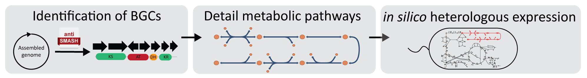

[](https://zenodo.org/badge/latestdoi/273448678)

# BiGMeC - Biosynthetic Gene cluster Metabolic pathway Constructor
The BiGMeC pipeline makes a draft reconstruction of the metabolic pathway associated with a non-ribosomal peptide synthetase (NRPS) or polyketide synthase (PKS) biosynthetic gene cluster. The pipeline takes an individual region Genbank (.gbk) file produced by [antiSMASH](https://antismash.secondarymetabolites.org) and produces a JSON-file that can be readily incoporporated into a genome-scale metabolic model using available software such as [cobrapy](cobrapy.readthedocs.io/) or [COBRA Toolbox](https://opencobra.github.io/cobratoolbox/stable/). The pipeline leverages the genome-scale metabolic model (GEM) of _S. coelicolor_ ([Sco-GEM](https://github.com/SysBioChalmers/Sco-GEM)) as a database for reactions and metabolites.
Read more about BiGMeC in [the research paper published in BMC Bioinformatics, February 2021](https://bmcbioinformatics.biomedcentral.com/articles/10.1186/s12859-021-03985-0)


## Requirements
- python 3 (>=3.5).
- conda or virtualenv, if you want to run the pipeline in a virtual environment (recommended).
- pip package manager. Neccessary to install required python packages. 

## Installation
The BiGMeC pipeline doesn't require any installation, you can simply clone the repository, install a few python packages and immediately run the program. 
### Clone repository
In your command line interface, change to your preferred directory and run
```
git clone https://github.com/AlmaasLab/BiGMeC.git
```
### Make virtual environment
It is recommend to run the pipeline in a virtual environment. You can create this environment with both [virtuealenv](https://virtualenv.pypa.io/en/latest/) or [conda](https://docs.anaconda.com/anaconda/install/), but here we only show how to do it with conda.
From the BiGMeC repository create the environment by running:
```
conda create -n bigmec python=3.6 
```
Activate the new environment:
```
conda activate bigmec
```
### Install required packages
Finally, use pip to install to the required packages listed in _requirements.txt_:
```
pip install -r requirements.txt
```
If you receive an error during the installation of python-libsbml (which is used by cobrapy) you might need to install [cmake](https://cmake.org/) first.

## Usage
### Basic use
To test the pipeline you can simply change directory to the [Scripts](Scripts) folder and run:
```
python bigmec.py
```
This will run the pipeline for the MIBiG gene cluster [BGC0000001](https://mibig.secondarymetabolites.org/repository/BGC0000001/index.html#r1c1) using the corresponding antiSMASH result file [Data/mibig/1.gbk](Data/mibig/1.gkb). The result will be stored in [Data/constructed_pathways/1.json](Data/constructed_pathways/1.json).

To use your own antiSMASH result and store the results in a specified folder run:
```
python bigmec.py -f antismash_data_filename_or_folder -o output_folder
```
Note that antiSMASH provides both a GenBank file that contains all identified clusters, and cluster / region specific GenBank-files. It is the region-specific files that should be used as input for the BiGMeC pipeline.
Further information is provided by running 
```
python bigmec.py -h
```

### Adding constructed pathways directly to a GEM
The constructed pathways can be added to a GEM immediately by using the `--add-to-model` specifing the the path to the GEM (in SBML format) that the pathway should be appended to. Not that the model must use the [BiGG](bigg.ucsd.edu/) namespace for this to work. E.g. if you want to add one pathway (or all pathways in the folder) to the _E. coli_ model [iML1515](http://bigg.ucsd.edu/models/iML1515) you can do so by running
```
python bigmec.py -f antismash_data_filename_or_folder -o output_folder --add-to-model path/to/iML1515.xml 
```
### Using a difference reference library
The current version of BiGMeC uses the [BIGG universal model](http://bigg.ucsd.edu/data_access) as a library of metabolites and reactions. However, the pipeline can also use any GEM that is based on the [BiGG](http://bigg.ucsd.edu/) namespace as the reference. The metabolites in the universal model lack formula and charge, so it can be better to use a well-curated model if these details are important. The [Sco-GEM](https://github.com/SysBioChalmers/Sco-GEM) model is available for this purpose in the [Models](Models) folder.

## Contributors
- [Snorre Sulheim](https://www.sintef.no/en/all-employees/employee/?empId=5675) ([@sulheim](https://github.com/sulheim)), SINTEF Industry, Norway / Norwegian University of Science and Technology, Norway
- [Fredrik Aunaas Fossheim](https://no.linkedin.com/in/fredrik-aunaas-fossheim)([@FredrikFossheim](https://github.com/FredrikFossheim)), Norwegian University of Science and Technology, Norway

## Contribute
Contributions are very welcome, either by raising issues or through pull requests. 

## Cite us
If you use the BiGMeC software, please cite us:

Sulheim, S., Fossheim, F.A., Wentzel, A. & Almaas, E. Automatic reconstruction of metabolic pathways from identified biosynthetic gene clusters. BMC Bioinformatics 22, 81 (2021). https://doi.org/10.1186/s12859-021-03985-0

